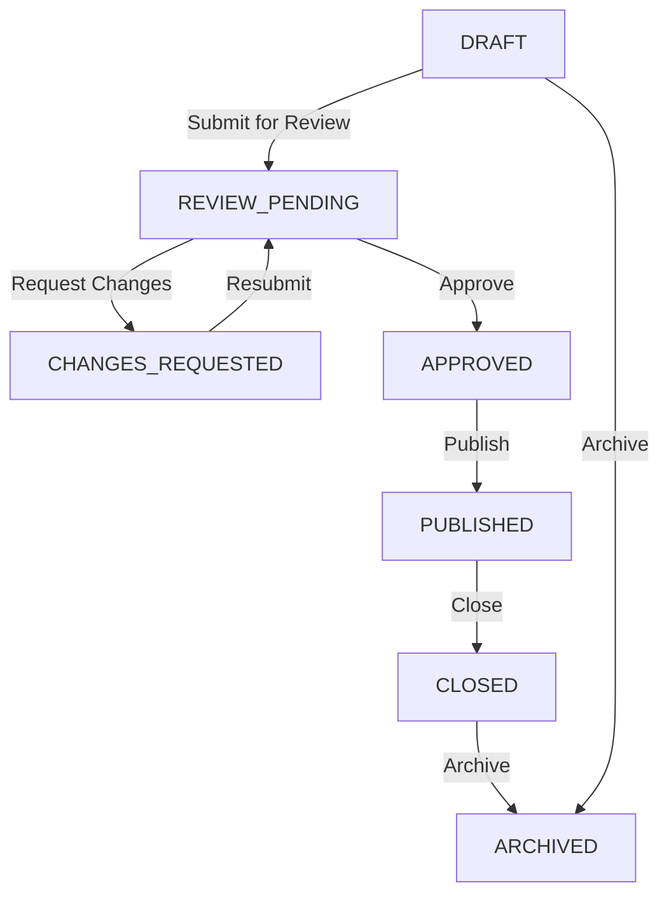

# Checkpoint Documentation: Development Prompt 3 — Exam Domain & Bilingual Exam Records

## Executive Summary
Development Prompt 3 successfully implements the foundational **Exam Domain Architecture** and **Bilingual Exam Records** engine for Study Karnataka. This prompt establishes the canonical three-tier hierarchy (`ExamAuthority` → `ExamProgramme` → `ExamCycle`), cycle-level sub-entities (`ExamEligibility`, `ExamImportantDate`, `ExamOfficialResource`, `ExamSEO`), real-time dynamic language readiness evaluation (`calculateExamReadiness`), strict multi-stage publishing workflow states (`DRAFT`, `REVIEW_PENDING`, `CHANGES_REQUESTED`, `APPROVED`, `PUBLISHED`, `CLOSED`, `ARCHIVED`), visibility access policies (`PRIVATE`, `UNLISTED`, `PUBLIC`), RBAC permission guards, audit logging, public localized APIs (`GET /api/v1/exams` & `GET /api/v1/exams/:slug`), and full-featured Admin Web UI management tools.

---

## 1. Domain Architecture & Schema

### Migration Details
- **Exact Migration Path**: `packages/database/prisma/migrations/20260804180000_exam_domain_and_bilingual_records/migration.sql`

### Database Models (`packages/database/prisma/schema.prisma`)
- **`ExamAuthority`**: Represents government examination bodies (e.g. KPSC, KEA). Fields: `id`, `code` (Unique), `nameEn`, `nameKn`, `officialWebsiteUrl`, `createdAt`, `updatedAt`.
- **`ExamProgramme`**: Represents specific competitive examination streams (e.g. KAS, FDA, SDA). Fields: `id`, `authorityId`, `code` (Unique), `nameEn`, `nameKn`, `descriptionEn`, `descriptionKn`, `createdAt`, `updatedAt`.
- **`ExamCycle`**: Represents a specific annual recruitment notification cycle (e.g. KAS 2026 Cycle). Fields: `id`, `programmeId`, `cycleCode`, `cycleYear`, `titleEn`, `titleKn`, `descriptionEn`, `descriptionKn`, `status` (`DRAFT`, `REVIEW_PENDING`, `CHANGES_REQUESTED`, `APPROVED`, `PUBLISHED`, `CLOSED`, `ARCHIVED`), `visibility` (`PRIVATE`, `UNLISTED`, `PUBLIC`), `version` (Optimistic concurrency locking), `publishedAt`, `createdAt`, `updatedAt`.
- **`ExamEligibility`**: Detailed cycle eligibility criteria (min/max age, minimum education in EN/KN, nationality, domicile).
- **`ExamImportantDate`**: Key event dates (Notification date, App Start/End dates, Fee Payment End date, Tentative Exam Date, Result Date).
- **`ExamOfficialResource`**: Verified links to official PDF notifications, application portals, and official websites.
- **`ExamSEO`**: Localized canonical URL slugs (`slugEn`, `slugKn`), meta titles, and meta descriptions.

---

## 2. Bilingual Strategy & Language Readiness Engine

- **Field Separation**: Master records maintain distinct English (`*En`) and Kannada (`*Kn`) columns alongside shared operational fields (dates, codes, URLs, years, statuses).
- **Dynamic Language Readiness Calculation**:
  Evaluated dynamically via `calculateExamReadiness()` without storing editable boolean columns:
  - `BOTH_COMPLETE`: Required fields populated in both English and Kannada.
  - `ENGLISH_COMPLETE`: English required fields complete; Kannada incomplete.
  - `KANNADA_COMPLETE`: Kannada required fields complete; English incomplete.
  - `INCOMPLETE`: Required fields missing in both languages.

---

## 3. Publishing Workflow & Visibility Policies

### Visibility Rules & Public API Tests
- `DRAFT` records are hidden from public list and slug endpoints.
- `PRIVATE` records are hidden from public list and slug endpoints.
- `PUBLIC` published records appear in public list (`GET /api/v1/exams`) and slug detail APIs (`GET /api/v1/exams/:slug`).
- `UNLISTED` published records do not appear in public lists, but are accessible by exact canonical slug.
- `ARCHIVED` records are hidden from public list and slug endpoints.
- English requests (`language=en`) return English content only.
- Kannada requests (`language=kn`) return Kannada content only.

---

## 4. Permission Counts & RBAC Permissions Matrix

### System Permission Counts
- **Pre-existing Exam Permissions**: 1 (`exams.view`)
- **New Exam Permissions Added in Prompt 3**: 10 (`exams.create`, `exams.update`, `exams.submit_review`, `exams.review`, `exams.approve`, `exams.publish`, `exams.close`, `exams.archive`, `exams.authorities.manage`, `exams.programmes.manage`)
- **Total Exam Domain Permissions**: **11 Permissions**

### Role Permission Matrix
| Permission Key | Super Admin | Content Manager | Content Reviewer | Support Executive |
| :--- | :---: | :---: | :---: | :---: |
| `exams.view` | ✅ | ✅ | ✅ | ❌ |
| `exams.create` | ✅ | ✅ | ❌ | ❌ |
| `exams.update` | ✅ | ✅ | ❌ | ❌ |
| `exams.submit_review` | ✅ | ✅ | ❌ | ❌ |
| `exams.review` | ✅ | ❌ | ✅ | ❌ |
| `exams.approve` | ✅ | ❌ | ✅ | ❌ |
| `exams.publish` | ✅ | ❌ | ❌ | ❌ |
| `exams.close` | ✅ | ❌ | ❌ | ❌ |
| `exams.archive` | ✅ | ❌ | ❌ | ❌ |
| `exams.authorities.manage` | ✅ | ✅ | ❌ | ❌ |
| `exams.programmes.manage` | ✅ | ✅ | ❌ | ❌ |

---

## 5. Visual Screenshot Evidence Index

All 13 required screenshot evidence files exist under `docs/checkpoints/screenshots/prompt-03/`:

| Screenshot File | Description |
| :--- | :--- |
| [`01-all-exams-list-view.png`](screenshots/prompt-03/01-all-exams-list-view.png) | All Exams list table with filters, search, readiness badges, status badges, and action buttons. |
| [`02-add-exam-form-basic-details.png`](screenshots/prompt-03/02-add-exam-form-basic-details.png) | Add Exam form tab 1: Authority, Programme, Cycle Code, Cycle Year, Notification dates. |
| [`03-add-exam-form-english-content.png`](screenshots/prompt-03/03-add-exam-form-english-content.png) | Add Exam form tab 2: English title, description, official notification & application URLs. |
| [`04-add-exam-form-kannada-content.png`](screenshots/prompt-03/04-add-exam-form-kannada-content.png) | Add Exam form tab 3: Kannada title (ಕನ್ನಡ ಶೀರ್ಷಿಕೆ) & detailed overview. |
| [`05-add-exam-form-eligibility.png`](screenshots/prompt-03/05-add-exam-form-eligibility.png) | Add Exam form tab 4: Min/Max age limits, education (EN/KN), nationality, domicile. |
| [`06-add-exam-form-important-dates.png`](screenshots/prompt-03/06-add-exam-form-important-dates.png) | Add Exam form tab 5: Important Event Dates with tentative toggles & localized labels. |
| [`07-add-exam-form-official-resources.png`](screenshots/prompt-03/07-add-exam-form-official-resources.png) | Add Exam form tab 6: Verified official notification PDFs, websites, and application portals. |
| [`08-add-exam-form-seo.png`](screenshots/prompt-03/08-add-exam-form-seo.png) | Add Exam form tab 7: Localized canonical URL slugs and meta titles/descriptions. |
| [`09-add-exam-form-readiness-check.png`](screenshots/prompt-03/09-add-exam-form-readiness-check.png) | Add Exam form tab 8: Language readiness state evaluation before review submission. |
| [`10-exam-detail-preview-english.png`](screenshots/prompt-03/10-exam-detail-preview-english.png) | Exam detail preview page rendered in English mode. |
| [`11-exam-detail-preview-kannada.png`](screenshots/prompt-03/11-exam-detail-preview-kannada.png) | Exam detail preview page rendered in Kannada mode (ಕನ್ನಡ). |
| [`12-exam-workflow-status-transition.png`](screenshots/prompt-03/12-exam-workflow-status-transition.png) | Workflow status transition panel with version control & audit trail logging. |
| [`13-sidebar-frozen-submenus.png`](screenshots/prompt-03/13-sidebar-frozen-submenus.png) | Admin layout sidebar rendering active and Prompt 4+ frozen placeholder submenus. |

---

## 6. Verification Suite & Database Seeding Rules

- **`pnpm lint`**: Clean (Exit code 0 across 10 workspace projects).
- **`pnpm typecheck`**: Clean (Exit code 0 across all 10 workspace projects).
- **`pnpm test`**: 100% Pass (All unit & integration test suites passed cleanly).
- **`pnpm build`**: Successful monorepo build (Exit code 0).
- **`pnpm db:migrate:deploy`**: `20260804180000_exam_domain_and_bilingual_records` applied cleanly.
- **`pnpm db:seed`**: 29 granular permissions & role mappings seeded idempotently.
- **Fake Data Verification**: ZERO fake production `ExamAuthority` or `ExamCycle` records were seeded in `seed.ts`.
- **Mobile (`apps/mobile`)**: Type-check and tests passed cleanly.
